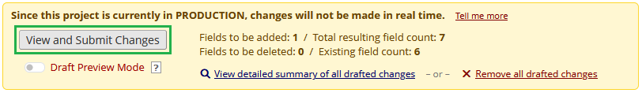
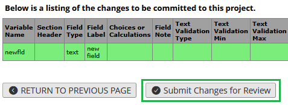

********************************************************************************
# Force Draft Review

Luke Stevens, Murdoch Children's Research Institute https://www.mcri.edu.au

[https://github.com/lsgs/redcap-force-draft-review/](https://github.com/lsgs/redcap-force-draft-review/)

********************************************************************************
## Summary

Changes the "Submit Changes for Review" button in the Online Designer and Data Dictionary pages to redirect to the "View summary of drafted changes" page. Changes may then be submitted from there. This behaviour prevents users from submitting draft changes without visiting the summary page where potential problems are highlighted.

## Configuration

* This module is designed to be used in the "Enable on all projects" mode, but may be enabled only on individual projects if preferred.
* System Setting: (Optional) Specify preferred text for the "Submit Changes for Review" button across all projects. Suggestion: "View and Submit Changes".
* Project Setting: (Optional) Specify preferred text for the "Submit Changes for Review" button in the current project. (Takes precedence over the system-level setting.)

## Screenshots

### Online Designer / Data Dictionary

The "Submit Changes for Review" button is relabelled, and on clicking will take you to the "Summary of Drafted Changes" page.

### Summary of Drafted Changes

Draft changes may be submitted at the bottom of the "Summary of Drafted Changes" page after reviewing the summary of changes.

